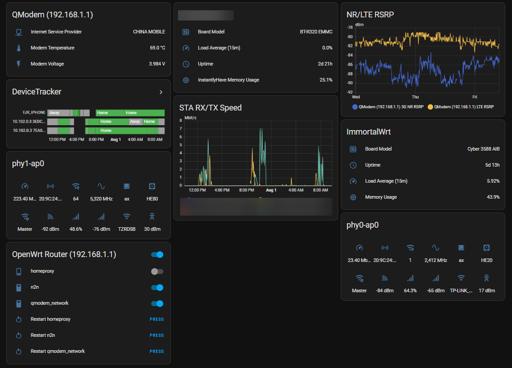
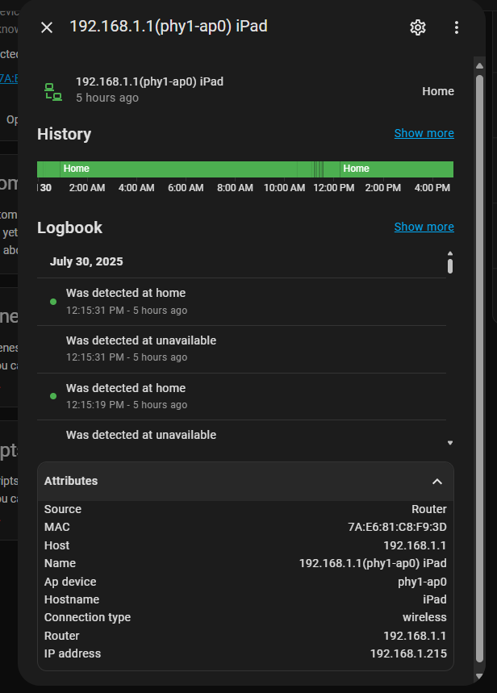
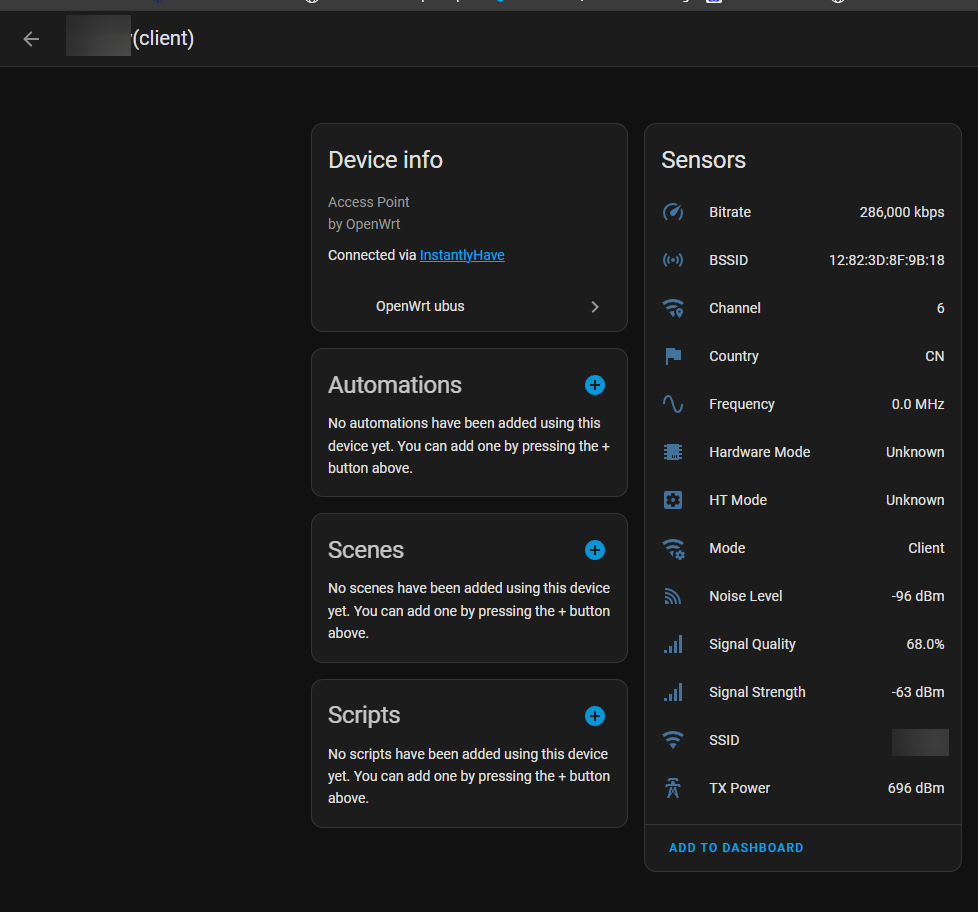

# OpenWrt Ubus Home Assistant 集成

**中文版本** | [English Version](README.md)

> **📝 AI 生成文档声明**  
> 本 README 主要由 AI 生成和增强，以提供全面的文档说明。我们欢迎社区贡献者帮助改进和完善此文档。您的反馈和建议非常宝贵！

## 🚀 项目概述

OpenWrt Ubus 集成是一个功能全面的 Home Assistant 自定义集成，它将您的 OpenWrt 路由器转变为强大的智能家居中枢。通过利用 OpenWrt 原生的 ubus 接口，此集成在 Home Assistant 中提供实时设备跟踪、系统监控和高级网络管理功能。


*Home Assistant 中 OpenWrt Ubus 集成功能的完整概览*

## 🎯 功能概览

本集成提供以下全面功能：

### 1️⃣ AP 接口管理
监控和管理 OpenWrt 接入点（AP）接口的详细状态信息：
- **� AP 主机模式**：查看托管的无线网络，包括 SSID、加密、频道信息、连接客户端数量和带宽利用率
- **📶 AP 客户端模式**：监控上游无线网络连接，包括信号强度、数据速率和连接质量指标
- **🔧 实时状态**：实时更新无线标准（802.11n/ac/ax）、频道宽度和连接稳定性
- **📊 性能指标**：跟踪数据吞吐量、信号质量和干扰水平

### 2️⃣ STA 设备管理  
全面管理连接到 AP 接口的设备：
- **🏷️ 设备识别**：显示主机名、MAC 地址、IP 分配和连接时长
- **📶 信号监控**：实时信号强度（RSSI）、连接质量和数据速率跟踪
- **⏱️ 连接指标**：监控连接时间、认证状态和漫游行为
- **🚫 设备控制**：使用 hostapd 无线服务踢出/断开不需要的客户端（需要安装 hostapd）
- **🔄 动态发现**：自动检测并为新连接的设备创建实体

### 3️⃣ STA 设备跟踪器
为每个连接的站点创建独立的设备跟踪器实体：
- **🏠 在家检测**：基于 WiFi 的在家/离家检测功能
- **📍 位置跟踪**：识别每个设备连接到哪个 AP 接口
- **⚡ 实时更新**：设备连接或断开时的即时状态变化
- **🔗 设备关联**：正确的设备关系，在各自的 AP 接口下显示连接的设备

### 4️⃣ 系统管理
监控和控制 OpenWrt 系统资源和服务：
- **📊 系统信息**：跟踪运行时间、CPU 使用率、内存利用率（总计/空闲/缓存/缓冲区）和负载平均值（1/5/15 分钟）
- **🎛️ 服务控制**：启动、停止、启用、禁用和重启由 procd 管理的系统服务
- **🔧 服务监控**：实时状态监控关键服务，如 dnsmasq、dropbear、firewall、network、uhttpd、wpad
- **📈 性能跟踪**：持续监控系统健康指标和资源利用率

### 5️⃣ QModem 管理
监控由 QModem 管理的 4G/5G 蜂窝调制解调器信息：
- **� 信号质量**：跟踪信号强度、质量指标和网络注册状态
- **🌡️ 调制解调器健康**：监控温度、功率水平和运行状态
- **📊 连接统计**：查看数据使用情况、连接运行时间和网络运营商信息
- **🔗 网络详情**：显示基站信息、网络技术（4G/5G）和连接模式

### 6️⃣ Via Device 实现
正确的设备层次结构和 via_device 关系：
- **� 路由器级别**：主路由器设备显示所有连接的 AP 接口和 QModem 作为子设备
- **📡 AP 接口级别**：每个 AP 接口作为设备显示所有连接的 STA 设备
- **📱 设备导航**：在 Home Assistant UI 中轻松导航路由器 → AP 接口 → 连接设备
- **🔗 逻辑分组**：符合真实网络拓扑的直观设备组织

## 📥 安装与设置

### 前置要求 ✅

在安装集成之前，请确保您的 OpenWrt 路由器满足以下要求：

**必需软件包：**
```bash
# 在您的 OpenWrt 路由器上安装必要软件包
opkg install rpcd uhttpd-mod-ubus

# 设备踢出功能（可选）
opkg install hostapd
```

**必需服务：**
```bash
# 启用必需服务
service rpcd start && service rpcd enable
service uhttpd start && service uhttpd enable
```

**路由器配置：**
- 🔧 `rpcd` 服务运行中（处理 ubus JSON-RPC）
- 🌐 `uhttpd` 支持 ubus（Web 界面后端）
- 🔐 有效的用户凭据和适当权限
- 🌍 Home Assistant 到路由器的网络访问

### 安装方法

#### 方法一：手动安装

1. **📂 下载**：克隆或下载此仓库
   ```bash
   git clone https://github.com/FUjr/homeassistant-openwrt-ubus.git
   ```

2. **📋 复制文件**：将集成复制到您的 Home Assistant
   ```bash
   cp -r homeassistant-openwrt-ubus/custom_components/openwrt_ubus /config/custom_components/
   ```

3. **🔄 重启**：重启 Home Assistant

4. **⚙️ 配置**：转到 **设置** → **设备与服务** → **添加集成**

5. **🔍 搜索**：查找 "OpenWrt ubus" 并按照设置向导进行配置

#### 方法二：HACS 安装（推荐）🌟

> **注意**：此集成可作为自定义 HACS 仓库使用

1. **➕ 添加仓库**：在 HACS 中，转到 **集成** → **⋮** → **自定义仓库**
   
2. **📦 安装**：添加 `https://github.com/FUjr/homeassistant-openwrt-ubus` 作为集成

3. **⬇️ 下载**：搜索 "OpenWrt ubus" 并安装

4. **🔄 重启**：重启 Home Assistant

5. **⚙️ 设置**：通过 **设置** → **设备与服务** 添加集成

### 路由器权限设置 🔐

为了增强功能（主机名解析），请配置 ACL 权限：

#### 创建 ACL 配置
```bash
# SSH 连接到您的 OpenWrt 路由器
ssh root@your_router_ip

# 创建 ACL 目录
mkdir -p /usr/share/rpcd/acl.d

# 为 Home Assistant 创建 ACL 文件
cat > /usr/share/rpcd/acl.d/hass.json << 'EOF'
{
  "hass": {
    "description": "OpenWrt ubus 集成的访问角色",
    "read": {
      "file": {
        "/tmp/*": [ "read" ]
      }
    }
  }
}
EOF

# 重启服务以应用更改
/etc/init.d/rpcd restart && /etc/init.d/uhttpd restart
```

> **重要**：没有 ACL 配置，设备名称可能显示为 MAC 地址而不是主机名。

## 🎛️ 功能与配置

### 初始设置 🛠️

1. **导航到集成**：转到 **设置** → **设备与服务** → **添加集成**
2. **搜索并添加**：搜索 "OpenWrt ubus" 并点击添加
3. **配置连接**：输入您的路由器详细信息

### 配置选项 📋

| 选项 | 描述 | 默认值 | 可用选项 |
|------|------|--------|----------|
| 🏠 **主机** | 路由器 IP 地址 | - | 任何有效的 IP 地址 |
| 👤 **用户名** | 登录用户名 | - | 通常为 'root' |
| 🔑 **密码** | 登录密码 | - | 路由器管理密码 |
| 📡 **无线软件** | 无线监控方法 | iwinfo | iwinfo, hostapd |
| 🌐 **DHCP 软件** | DHCP 客户端检测 | dnsmasq | dnsmasq, odhcpd, none |
| ⏱️ **系统超时** | 系统数据获取超时 | 30秒 | 5-300秒 |
| 📊 **QModem 超时** | QModem 数据获取超时 | 30秒 | 5-300秒 |
| ⚙️ **服务超时** | 服务控制超时 | 30秒 | 5-300秒 |
| 🚫 **设备踢出按钮** | 启用设备踢出功能 | 禁用 | 启用/禁用 |

---

### 📱 设备跟踪与站点管理

集成为连接到您 OpenWrt 路由器的所有设备提供全面的设备跟踪和管理。


*设备跟踪器实体显示连接的无线设备及实时状态*

#### 无线设备检测
- **iwinfo 方法**：使用 OpenWrt 的 iwinfo 进行系统级监控来检测无线客户端
- **hostapd 方法**：直接连接到 hostapd 守护程序获得实时更新和踢出功能
- **实时状态**：设备连接/断开时的实时更新和连接状态跟踪
- **设备属性**：MAC 地址、主机名、信号强度、连接时间和 AP 关联

#### DHCP 客户端监控
- **dnsmasq 集成**：通过租约文件解析监控来自 dnsmasq 服务器的 DHCP 租约
- **odhcpd 支持**：兼容 odhcpd DHCP 服务器的 IPv6 和现代 DHCP 功能
- **租约信息**：IP 地址、主机名、租约到期时间和客户端标识
- **自动发现**：自动检测新的 DHCP 客户端并创建跟踪实体

**STA 设备功能：**
- ✅ 亚秒级响应的实时连接状态更新
- 🏷️ 主机名解析（需要适当的 ACL 配置）
- 📍 设备位置跟踪（连接到哪个 AP 接口）
- ⏰ 带历史数据的连接时长跟踪
- 🔄 为新设备自动创建实体并正确命名
- 📶 带 RSSI 值和质量指标的信号强度监控

#### 连接设备信息传感器


*无线站点传感器显示信号强度和连接质量*

对于每个连接的设备，集成会创建详细的传感器实体：

**站点传感器包括：**
- **信号强度（RSSI）**：实时信号功率测量
- **连接质量**：链路质量百分比和稳定性指标
- **数据速率**：当前 TX/RX 速率和最大支持速度
- **连接时长**：设备连接到网络的时间
- **认证状态**：安全协议和加密信息
- **AP 接口**：设备连接到的接入点

---

### 📊 系统监控与健康

为您的 OpenWrt 路由器提供全面的系统健康和性能监控。


*系统传感器显示运行时间、内存使用和负载平均值*

#### 系统信息传感器
集成提供以下系统监控传感器：

- `sensor.openwrt_uptime` - 系统运行时间和启动时间跟踪
- `sensor.openwrt_load_1` - 1分钟负载平均值用于 CPU 利用率
- `sensor.openwrt_load_5` - 5分钟负载平均值用于中期趋势  
- `sensor.openwrt_load_15` - 15分钟负载平均值用于长期模式
- `sensor.openwrt_memory_total` - 总系统内存
- `sensor.openwrt_memory_free` - 当前空闲内存数量
- `sensor.openwrt_memory_available` - 应用程序可用内存
- `sensor.openwrt_memory_buffers` - 缓冲区使用的内存
- `sensor.openwrt_memory_cached` - 文件系统缓存使用的内存

#### QModem LTE/4G/5G 支持
为具有 LTE/4G/5G 功能的路由器监控蜂窝调制解调器状态。


*QModem 传感器显示 LTE 信号强度、连接状态和数据使用情况*

**QModem 传感器包括：**
- **信号强度与质量**：RSSI、SINR 和信号质量指标
- **连接状态**：注册状态、连接运行时间和网络可用性
- **数据使用统计**：传输和接收的数据量
- **网络信息**：运营商名称、基站 ID 和技术类型（4G/5G）
- **调制解调器健康**：温度监控和运行状态
- **连接详情**：IP 地址分配和连接模式信息

---

### 🌐 接入点管理与控制

监控和管理无线接入点，提供详细的状态信息和控制功能。

#### AP 客户端模式

*接入点处于客户端模式 - 连接到上游无线网络*

**客户端模式功能：**
- **上游连接**：监控到父接入点的连接
- **信号指标**：到上游 AP 的信号强度（RSSI）和质量
- **性能数据**：当前数据速率和连接稳定性
- **网络信息**：连接的 SSID、频道和安全协议
- **漫游支持**：跟踪上游接入点之间的切换

#### AP 主机模式

*接入点处于主机模式 - 为客户端托管无线网络*

**主机模式功能：**
- **连接客户端**：关联无线设备的实时计数
- **频道信息**：当前频道、宽度和干扰水平
- **网络配置**：SSID、加密类型和安全设置
- **性能指标**：带宽利用率和吞吐量统计
- **覆盖分析**：信号传播和覆盖质量数据
---

### 🎛️ 服务控制与系统管理

为 OpenWrt 系统服务提供全面的服务管理，具有实时状态监控和控制功能。


*用于管理 OpenWrt 系统服务的服务控制开关和按钮*

#### 开关实体
- **服务开关**：开启/关闭服务并提供实时状态反馈
- **实时状态监控**：显示每个被监控服务的当前运行状态
- **批量状态更新**：使用优化的 API 调用高效监控多个服务
- **状态同步**：自动状态刷新以保持与路由器状态的一致性

#### 按钮实体
集成通过专用按钮实体提供精细的服务控制：

- **🟢 启动服务**：启动已停止的服务并提供即时状态反馈
- **🔴 停止服务**：停止正在运行的服务并优雅关闭
- **✅ 启用服务**：启用服务在系统启动时自动运行
- **❌ 禁用服务**：禁用启动时自动运行同时保持当前状态
- **🔄 重启服务**：重启正在运行的服务并最小化停机时间

**管理的服务包括：**
由 procd 管理的重要 OpenWrt 系统服务：
- `dnsmasq` - 用于网络名称解析的 DNS 和 DHCP 服务器
- `dropbear` - 用于远程访问的轻量级 SSH 服务器守护程序
- `firewall` - Netfilter 防火墙配置和管理
- `network` - 网络接口配置和路由
- `uhttpd` - 用于 LuCI 界面和 ubus 通信的 Web 服务器
- `wpad` - 用于 WPA/WPA2/WPA3 认证的无线守护程序
- `odhcpd` - DHCPv6 和 IPv6 路由器通告守护程序
- `rpcd` - 用于 ubus JSON-RPC 通信的 RPC 守护程序
- 以及更多基于您的 OpenWrt 配置的系统服务...

**服务管理功能：**
- ⚡ 对状态变化的即时响应和实时反馈
- 🔄 控制操作后的自动状态刷新
- 🛡️ 带有详细用户反馈的全面错误处理
- 📊 优化的批量 API 调用以提高性能和减少路由器负载
- 🔍 服务依赖感知以确保安全的操作顺序

---

### 🚫 高级设备管理与控制

高级设备管理功能，包括从无线网络断开不需要设备的能力。


*用于断开特定无线客户端的设备踢出按钮*

#### 设备踢出功能
强制断开连接的无线设备并临时限制访问。

**设备踢出工作原理：**
1. **🔍 自动检测**：自动检测所有 AP 接口上的连接无线设备
2. **🆔 动态按钮创建**：为每个当前连接的设备创建单独的踢出按钮
3. **✅ 智能可用性**：按钮仅在以下情况下出现和运行：
   - 目标设备当前已连接且活跃
   - hostapd 服务正在运行且可通过 ubus 访问
   - 设备连接到受支持的接入点接口
   - 用户具有设备管理的适当权限
4. **⚡ 取消认证操作**：向目标设备发送 IEEE 802.11 取消认证命令
5. **🕐 临时访问禁止**：自动阻止重新连接 60 秒
6. **🔄 状态同步**：踢出操作后立即刷新设备状态

#### 连接设备概览

*所有连接设备的全面概览及管理控制*

**技术要求：**
- **📡 hostapd 服务**：必须安装、运行且可通过 ubus 接口访问
- **🌐 Ubus 集成**：hostapd 必须编译时包含 ubus 支持以进行设备管理
- **🔐 用户权限**：路由器用户账户必须具有 hostapd 控制的适当 ACL 权限

**设备踢出按钮详情：**
- **实体命名**：`button.kick_[设备名称]` 或 `button.kick_[mac地址]` 便于识别
- **丰富属性**：每个按钮包括设备 MAC、主机名、AP 接口、信号强度和连接时间
- **自动隐藏行为**：目标设备断开连接时按钮自动消失
- **多 AP 支持**：不同接入点接口上设备的独立踢出控制
- **安全功能**：通过确认和日志记录防止意外踢出

**配置与设置：**
出于安全考虑，设备踢出功能默认禁用。启用方法：
1. 导航到 **设置** → **设备与服务** → **OpenWrt ubus**
2. 点击集成条目上的 **配置**
3. 启用 **设备踢出按钮** 选项
4. 保存配置并重启集成
5. 确保在路由器上正确安装和配置 hostapd

**使用场景：**
- **🔒 安全**：立即断开可疑或未授权设备
- **📶 网络管理**：通过移除空闲或有问题的连接释放带宽  
- **👨‍👩‍👧‍👦 家长控制**：临时限制特定设备的访问
- **🔧 故障排除**：强制设备重新连接以解决连接问题

---

### 🔧 高级配置

#### 超时设置
- **系统传感器超时**：等待系统数据的时间（5-300秒）
- **QModem 超时**：LTE/4G 调制解调器查询超时（5-300秒）
- **服务超时**：服务控制操作超时（5-300秒）

#### 性能优化
- **批量 API 调用**：为效率组合多个 ubus 调用
- **智能缓存**：减少冗余 API 调用
- **可配置轮询**：调整每种传感器类型的更新频率
- **后台处理**：非阻塞操作以获得更好的性能

#### 软件兼容性
- **无线选项**：根据您的设置在 `iwinfo` 和 `hostapd` 之间选择
- **DHCP 选项**：支持 `dnsmasq`、`odhcpd` 或禁用 DHCP 监控
- **灵活配置**：适应不同的 OpenWrt 配置

## 🔧 故障排除

### 常见问题 ⚠️

**🚫 无法连接到路由器**
- ✅ 验证路由器 IP 地址和凭据
- ✅ 确保 OpenWrt 上的 `rpcd` 和 `uhttpd` 服务正在运行
- ✅ 检查防火墙设置是否允许 HTTP 访问 ubus

**❌ 未检测到设备**
- ✅ 验证无线和 DHCP 软件设置是否与您的 OpenWrt 配置匹配
- ✅ 检查路由器上是否正确配置了所选的监控方法

**⏰ 传感器未更新**
- ✅ 检查 Home Assistant 日志中的连接错误
- ✅ 验证路由器权限允许访问系统信息

**🏷️ 设备显示 MAC 地址而不是主机名**
- ✅ 确保主机名解析 ACL 配置正确（请参阅 [主机名解析配置](#主机名解析配置-🏷️)）
- ✅ 验证 DHCP 租约文件可访问：`/var/dhcp.leases` 或 `/tmp/dhcp.leases`
- ✅ 检查 rpcd 服务在 ACL 配置后已重启
- ✅ 确认用户账户分配到正确的 ACL 组

### 调试日志 �

添加到您的 `configuration.yaml`：

```yaml
logger:
  logs:
    custom_components.openwrt_ubus: debug
    homeassistant.components.device_tracker: debug
```

## 👨‍💻 开发

### 项目结构 📁
```
custom_components/openwrt_ubus/
├── __init__.py              # 主集成设置
├── config_flow.py           # 配置流程
├── const.py                 # 常量和配置
├── device_tracker.py        # 设备跟踪平台
├── sensor.py               # 传感器平台协调器
├── switch.py               # 服务控制开关
├── button.py               # 服务控制按钮和设备踢出协调
├── extended_ubus.py        # 增强的 ubus 客户端，支持批量 API 和 hostapd
├── shared_data_manager.py  # 共享数据管理和优化
├── manifest.json           # 集成清单
├── strings.json            # UI 字符串
├── services.yaml           # 服务定义
├── Ubus/                   # Ubus 通信库
│   ├── __init__.py
│   ├── const.py
│   └── interface.py
├── buttons/                # 按钮实体模块
│   ├── __init__.py
│   ├── service_button.py   # 服务控制按钮
│   └── device_kick_button.py # 设备踢出功能
├── sensors/                # 各个传感器模块
│   ├── __init__.py
│   ├── system_sensor.py    # 系统信息传感器
│   ├── qmodem_sensor.py    # QModem/LTE 传感器
│   ├── sta_sensor.py       # 无线站点传感器
│   └── ap_sensor.py        # 接入点传感器
---

### 🔧 高级配置与优化

#### 超时设置
根据您的网络和路由器性能微调集成性能：

- **系统传感器超时**：等待系统数据收集的时间（5-300秒）
  - *推荐*：大多数路由器 30秒，较旧硬件 60秒
- **QModem 超时**：LTE/4G/5G 调制解调器查询超时（5-300秒）  
  - *推荐*：稳定连接 30秒，信号较弱区域 120秒
- **服务超时**：服务控制操作超时（5-300秒）
  - *推荐*：本地操作 30秒，复杂服务链 60秒

#### 性能优化功能
- **智能批量 API 调用**：将多个 ubus 调用合并为单个请求以提高效率
- **高级缓存系统**：通过智能缓存失效减少冗余 API 调用
- **可配置更新间隔**：调整每种传感器类型的轮询频率以平衡数据新鲜度与系统负载
- **后台处理**：非阻塞操作确保 Home Assistant 响应性
- **内存优化**：高效的数据结构和清理确保长期稳定性

#### 软件兼容性矩阵
- **无线监控选项**： 
  - `iwinfo`：标准 OpenWrt 无线信息（兼容所有设置）
  - `hostapd`：直接 hostapd 集成（启用设备踢出功能）
- **DHCP 集成选项**： 
  - `dnsmasq`：传统 DHCP/DNS 服务器（最常见）
  - `odhcpd`：现代 DHCP 服务器，支持 IPv6
  - `none`：禁用 DHCP 监控（仅无线跟踪）
- **服务管理**：自动适应可用的 procd 管理服务

## 🔧 故障排除与支持

### 常见问题与解决方案 ⚠️

**🚫 无法连接到路由器**
- ✅ 验证路由器 IP 地址正确且可从 Home Assistant 访问
- ✅ 确认用户名和密码凭据有效
- ✅ 确保 `rpcd` 和 `uhttpd` 服务正在运行：`service rpcd status && service uhttpd status`
- ✅ 检查防火墙设置是否允许 HTTP 访问 ubus（端口 80/443）
- ✅ 测试连接性：`curl http://router_ip/ubus -d '{"jsonrpc":"2.0","method":"call","params":["00000000000000000000000000000000","session","login",{"username":"root","password":"your_password"}],"id":1}'`

**❌ 未检测到设备**
- ✅ 验证无线软件设置与您的 OpenWrt 配置匹配
- ✅ 检查 DHCP 软件设置是否对应您的 DHCP 服务器
- ✅ 确保路由器上正确配置了所选的监控方法
- ✅ 测试无线检测：`iwinfo` 或检查 hostapd 状态：`ubus call hostapd.wlan0 get_clients`
- ✅ 验证 DHCP 租约文件可访问性：`ls -la /var/dhcp.leases /tmp/dhcp.leases`

**⏰ 传感器未更新**
- ✅ 检查 Home Assistant 日志中的连接错误：`设置 → 系统 → 日志`
- ✅ 验证路由器权限允许访问系统信息
- ✅ 测试系统数据访问：`ubus call system info && ubus call system board`
- ✅ 检查 Home Assistant 和路由器之间的网络连接稳定性
- ✅ 查看集成配置中的超时设置

**🏷️ 设备显示 MAC 地址而不是主机名**
- ✅ 确保主机名解析 ACL 配置正确（请参阅 [路由器权限设置](#路由器权限设置-🔐)）
- ✅ 验证 DHCP 租约文件可访问：`/var/dhcp.leases` 或 `/tmp/dhcp.leases`
- ✅ 检查 rpcd 服务在 ACL 配置后已重启：`/etc/init.d/rpcd restart`
- ✅ 确认用户账户分配到正确的 ACL 组
- ✅ 测试文件访问：`ubus call file read '{"path":"/tmp/dhcp.leases"}'`

**🚫 设备踢出按钮不工作**
- ✅ 验证 hostapd 已安装并运行：`service hostapd status`
- ✅ 检查 hostapd ubus 集成：`ubus list | grep hostapd`
- ✅ 确保在集成配置中启用了设备踢出按钮
- ✅ 确认目标设备通过 hostapd 管理的接口连接
- ✅ 测试 hostapd 控制：`ubus call hostapd.wlan0 del_client '{"addr":"device_mac","reason":5,"deauth":true,"ban_time":60000}'`

### 调试日志与诊断 🐛

启用全面的故障排除日志记录：

```yaml
# 添加到 configuration.yaml
logger:
  default: warning
  logs:
    custom_components.openwrt_ubus: debug
    custom_components.openwrt_ubus.extended_ubus: debug
    custom_components.openwrt_ubus.shared_data_manager: debug
    homeassistant.components.device_tracker: debug
```

**日志分析技巧：**
- **连接问题**：查找 "Failed to connect" 或 "Timeout" 消息
- **认证问题**：搜索 "401" 或 "authentication failed" 错误
- **设备检测**：检查 "No devices found" 或解析错误
- **服务控制**：监控 "Service operation failed" 消息

### 性能监控 📊

使用内置指标监控集成性能：
- **API 响应时间**：检查日志中的慢 ubus 调用（>5秒）
- **更新间隔**：验证传感器在预期时间框架内更新
- **错误率**：监控重复发生的连接或解析错误
- **内存使用**：确保 Home Assistant 内存保持稳定

## 👨‍💻 开发与架构

### 项目结构 📁
```
custom_components/openwrt_ubus/
├── __init__.py              # 主集成设置和协调器管理
├── config_flow.py           # 用户配置流程和验证
├── const.py                 # 常量、默认值和配置架构
├── device_tracker.py        # 设备跟踪平台实现
├── sensor.py               # 传感器平台协调器和实体管理
├── switch.py               # 具有实时状态的服务控制开关
├── button.py               # 服务控制和设备踢出按钮协调
├── extended_ubus.py        # 增强的 ubus 客户端，支持批量 API 和 hostapd
├── shared_data_manager.py  # 集中数据管理和缓存优化
├── manifest.json           # 集成清单和依赖项
├── strings.json            # UI 字符串和用户界面文本
├── services.yaml           # 服务操作定义
├── Ubus/                   # 核心 ubus 通信库
│   ├── __init__.py
│   ├── const.py           # ubus 协议常量
│   └── interface.py       # 低级 ubus 接口实现
├── buttons/                # 按钮实体模块
│   ├── __init__.py
│   ├── service_button.py   # 服务控制按钮（启动/停止/重启/启用/禁用）
│   └── device_kick_button.py # 设备踢出功能与 hostapd 集成
├── sensors/                # 各个传感器平台模块
│   ├── __init__.py
│   ├── system_sensor.py    # 系统信息传感器（运行时间、内存、负载）
│   ├── qmodem_sensor.py    # QModem/LTE 传感器（信号、连接、数据）
│   ├── sta_sensor.py       # 无线站点传感器（每设备指标）
│   └── ap_sensor.py        # 接入点传感器（接口状态）
└── translations/           # 多语言支持的本地化文件
    ├── en.json            # 英文翻译
    └── zh.json            # 中文翻译
```

### 集成架构 🏗️

**数据流架构：**
1. **SharedDataUpdateCoordinator**：具有批量 API 优化的中央数据管理
2. **ExtendedUbus**：增强的 ubus 客户端，集成 hostapd 和错误处理
3. **平台模块**：专门的传感器/实体实现
4. **缓存层**：具有失效策略的智能缓存

**关键设计模式：**
- **协调器模式**：具有实体订阅的集中数据更新
- **工厂模式**：基于检测到的设备/服务的动态实体创建
- **观察者模式**：使用最少 API 调用的实时更新
- **策略模式**：可配置的无线/DHCP 检测方法

### 贡献指南 🤝

1. **🍴 Fork 仓库**：创建您自己的开发 fork
2. **🌿 创建功能分支**：使用描述性分支名称（`feature/device-kick-improvements`）
3. **✏️ 代码质量**：遵循 Home Assistant 开发指南
4. **🧪 彻底测试**：使用各种 OpenWrt 配置进行测试
5. **� 记录更改**：更新 README 和代码注释
6. **�📤 提交 Pull Request**：提供详细的更改描述

**开发设置：**
- 使用多个 OpenWrt 版本测试（21.02、22.03、snapshot）
- 验证与不同无线驱动程序的兼容性（ath9k、ath10k、mt76）
- 测试各种硬件平台（MIPS、ARM、x86）

## 📄 许可证

本项目根据 Mozilla Public License 2.0 (MPL-2.0) 许可 - 详情请参阅 LICENSE 文件。

## 🆘 支持与社区

- **🐛 GitHub Issues**：[报告错误或请求功能](https://github.com/fujr/homeassistant-openwrt-ubus/issues)
- **💬 Home Assistant 社区**：[在论坛讨论](https://community.home-assistant.io/)
- **📖 OpenWrt 文档**：[官方 OpenWrt Wiki](https://openwrt.org/docs/start)
- **🔧 ubus 参考**：[OpenWrt ubus 文档](https://openwrt.org/docs/techref/ubus)

## 🙏 致谢

- **🔧 OpenWrt 项目**：提供优秀的开源路由器固件和强大的 API
- **🏠 Home Assistant 社区**：提供集成开发资源、测试和反馈
- **👥 贡献者与测试者**：通过错误报告、功能请求和代码贡献帮助改进此集成的社区成员
- **📚 文档贡献者**：特别感谢帮助改进和完善此文档的贡献者

---

> **📝 欢迎文档贡献！**  
> 此 README 受益于社区的大量投入。如果您发现可以改进的地方、不清楚的说明或缺失的信息，请通过 issues 或 pull requests 贡献。您的经验和反馈有助于为每个人改进此集成！
