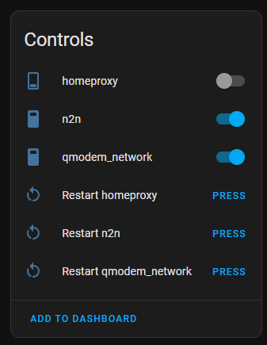
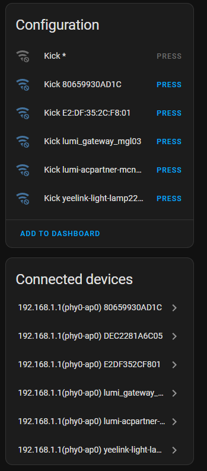
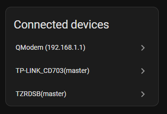

# OpenWrt Ubus Home Assistant 集成

**中文版本** | [English Version](README.md)

## 🚀 项目概述

OpenWrt Ubus 集成是一个功能全面的 Home Assistant 自定义集成，它将您的 OpenWrt 路由器转变为强大的智能家居中枢。通过利用 OpenWrt 原生的 ubus 接口，此集成在 Home Assistant 中提供实时设备跟踪、系统监控和高级网络管理功能。


*Home Assistant 中 OpenWrt Ubus 集成功能的完整概览*

### 核心功能

🔍 **实时设备跟踪** - 监控所有连接的无线和 DHCP 设备，提供实时状态更新  
� **系统监控** - 跟踪路由器性能、运行时间、内存使用和负载统计  
🎛️ **服务管理** - 远程启动、停止和控制 OpenWrt 系统服务  
📡 **无线控制** - 管理接入点并踢出不需要的设备  
🌐 **多协议支持** - 兼容各种 OpenWrt 软件配置  
⚡ **性能优化** - 批量 API 调用和智能缓存，最大限度减少资源使用

## 📥 安装与设置

### 前置要求 ✅

在安装集成之前，请确保您的 OpenWrt 路由器满足以下要求：

**必需软件包：**
```bash
# 在您的 OpenWrt 路由器上安装必要软件包
opkg install rpcd uhttpd-mod-ubus

# 设备踢出功能（可选）
opkg install hostapd
```

**必需服务：**
```bash
# 启用必需服务
service rpcd start && service rpcd enable
service uhttpd start && service uhttpd enable
```

**路由器配置：**
- 🔧 `rpcd` 服务运行中（处理 ubus JSON-RPC）
- 🌐 `uhttpd` 支持 ubus（Web 界面后端）
- 🔐 有效的用户凭据和适当权限
- 🌍 Home Assistant 到路由器的网络访问

### 安装方法

#### 方法一：手动安装

1. **📂 下载**：克隆或下载此仓库
   ```bash
   git clone https://github.com/FUjr/homeassistant-openwrt-ubus.git
   ```

2. **📋 复制文件**：将集成复制到您的 Home Assistant
   ```bash
   cp -r homeassistant-openwrt-ubus/custom_components/openwrt_ubus /config/custom_components/
   ```

3. **🔄 重启**：重启 Home Assistant

4. **⚙️ 配置**：转到 **设置** → **设备与服务** → **添加集成**

5. **🔍 搜索**：查找 "OpenWrt ubus" 并按照设置向导进行配置

#### 方法二：HACS 安装（推荐）🌟

> **注意**：此集成可作为自定义 HACS 仓库使用

1. **➕ 添加仓库**：在 HACS 中，转到 **集成** → **⋮** → **自定义仓库**
   
2. **📦 安装**：添加 `https://github.com/FUjr/homeassistant-openwrt-ubus` 作为集成

3. **⬇️ 下载**：搜索 "OpenWrt ubus" 并安装

4. **🔄 重启**：重启 Home Assistant

5. **⚙️ 设置**：通过 **设置** → **设备与服务** 添加集成

### 路由器权限设置 🔐

为了增强功能（主机名解析），请配置 ACL 权限：

#### 创建 ACL 配置
```bash
# SSH 连接到您的 OpenWrt 路由器
ssh root@your_router_ip

# 创建 ACL 目录
mkdir -p /usr/share/rpcd/acl.d

# 为 Home Assistant 创建 ACL 文件
cat > /usr/share/rpcd/acl.d/hass.json << 'EOF'
{
  "hass": {
    "description": "OpenWrt ubus 集成的访问角色",
    "read": {
      "file": {
        "/tmp/*": [ "read" ]
      }
    }
  }
}
EOF

# 重启服务以应用更改
/etc/init.d/rpcd restart && /etc/init.d/uhttpd restart
```

> **重要**：没有 ACL 配置，设备名称可能显示为 MAC 地址而不是主机名。

## 🎛️ 功能与配置

### 初始设置 🛠️

1. **导航到集成**：转到 **设置** → **设备与服务** → **添加集成**
2. **搜索并添加**：搜索 "OpenWrt ubus" 并点击添加
3. **配置连接**：输入您的路由器详细信息

### 配置选项 📋

| 选项 | 描述 | 默认值 | 可用选项 |
|------|------|--------|----------|
| 🏠 **主机** | 路由器 IP 地址 | - | 任何有效的 IP 地址 |
| 👤 **用户名** | 登录用户名 | - | 通常为 'root' |
| 🔑 **密码** | 登录密码 | - | 路由器管理密码 |
| 📡 **无线软件** | 无线监控方法 | iwinfo | iwinfo, hostapd |
| 🌐 **DHCP 软件** | DHCP 客户端检测 | dnsmasq | dnsmasq, odhcpd, none |
| ⏱️ **系统超时** | 系统数据获取超时 | 30秒 | 5-300秒 |
| 📊 **QModem 超时** | QModem 数据获取超时 | 30秒 | 5-300秒 |
| ⚙️ **服务超时** | 服务控制超时 | 30秒 | 5-300秒 |
| 🚫 **设备踢出按钮** | 启用设备踢出功能 | 禁用 | 启用/禁用 |

---

### 📱 设备跟踪

集成为连接到您 OpenWrt 路由器的所有设备提供全面的设备跟踪。


*设备跟踪器实体显示连接的无线设备及实时状态*

#### 无线设备检测
- **iwinfo 方法**：使用 OpenWrt 的 iwinfo 检测无线客户端
- **hostapd 方法**：直接连接到 hostapd 守护程序获得实时更新
- **实时状态**：设备连接/断开时的实时更新
- **设备属性**：MAC 地址、主机名、信号强度、连接时间

#### DHCP 客户端监控
- **dnsmasq 集成**：监控来自 dnsmasq 服务器的 DHCP 租约
- **odhcpd 支持**：兼容 odhcpd DHCP 服务器
- **租约信息**：IP 地址、主机名、租约到期时间
- **自动发现**：自动检测新的 DHCP 客户端

**功能特点：**
- ✅ 实时连接状态更新
- 🏷️ 主机名解析（需要适当的 ACL 配置）
- 📍 设备位置跟踪（连接到哪个 AP）
- ⏰ 连接持续时间跟踪
- 🔄 为新设备自动创建实体

---

### 📊 系统监控

为您的 OpenWrt 路由器提供全面的系统健康和性能监控。


*系统传感器显示运行时间、内存使用和负载平均值*

#### 系统信息传感器
- `sensor.openwrt_uptime` - 系统运行时间和启动时间
- `sensor.openwrt_load_1` - 1分钟负载平均值
- `sensor.openwrt_load_5` - 5分钟负载平均值
- `sensor.openwrt_load_15` - 15分钟负载平均值
- `sensor.openwrt_memory_*` - 内存统计（总计、空闲、可用、缓冲区、缓存）

#### QModem LTE/4G 支持
为具有 LTE/4G 功能的路由器监控蜂窝调制解调器状态。


*QModem 传感器显示 LTE 信号强度、连接状态和数据使用情况*

**QModem 传感器包括：**
- 信号强度和质量
- 连接状态和运行时间
- 数据使用统计
- 网络运营商信息
- 调制解调器温度和状态

#### 无线站点信息
跟踪每个连接设备的详细无线连接信息。


*无线站点传感器显示信号强度和连接质量*

**站点传感器：**
- 信号强度（RSSI）
- 连接质量
- 数据速率（TX/RX）
- 连接持续时间
- 认证状态

---

### 🌐 接入点管理

监控和管理无线接入点，提供详细的状态信息。

#### AP 客户端模式

*接入点处于客户端模式 - 连接到上游无线网络*

**客户端模式功能：**
- 上游 AP 连接状态
- 到父 AP 的信号强度
- 数据速率和质量指标
- 连接稳定性监控

#### AP 主机模式

*接入点处于主机模式 - 为客户端托管无线网络*

**主机模式功能：**
- 连接的客户端数量
- 频道信息
- 加密状态
- 带宽利用率
- 网络配置详情

---

### 🎛️ 服务控制

为 OpenWrt 系统服务提供全面的服务管理，具有实时状态监控。


*用于管理 OpenWrt 系统服务的服务控制开关和按钮*

#### 开关实体
- **服务开关**：开启/关闭服务并显示实时状态
- **实时状态**：显示每个服务的当前运行状态
- **批量更新**：高效监控多个服务的状态

#### 按钮实体
- **🟢 启动服务**：启动已停止的服务
- **🔴 停止服务**：停止正在运行的服务
- **✅ 启用服务**：启用服务在启动时自动运行
- **❌ 禁用服务**：禁用启动时自动运行
- **🔄 重启服务**：重启正在运行的服务

**管理的服务包括：**
- `dnsmasq` - DNS 和 DHCP 服务器
- `dropbear` - SSH 服务器守护程序
- `firewall` - Netfilter 防火墙
- `network` - 网络配置
- `uhttpd` - Web 服务器
- `wpad` - 无线守护程序
- 以及更多系统服务...

**功能特点：**
- ⚡ 对状态变化的即时响应
- 🔄 操作后自动状态刷新
- 🛡️ 带有详细反馈的错误处理
- 📊 为性能优化的批量 API 调用

---

### 🚫 设备管理与控制

高级设备管理功能，包括断开不需要设备的能力。


*用于断开特定无线客户端的设备踢出按钮*

#### 设备踢出功能
强制断开连接的无线设备并临时禁止。

**工作原理：**
1. **🔍 自动检测**：自动检测连接的无线设备
2. **🆔 动态按钮**：为每个连接的设备创建踢出按钮
3. **✅ 可用性检查**：按钮仅在以下情况下出现：
   - 设备当前已连接
   - hostapd 服务正在运行
   - 设备在受支持的接入点上
4. **⚡ 踢出动作**：发送取消认证命令
5. **🕐 临时禁止**：自动禁止设备 60 秒
6. **🔄 状态更新**：操作后刷新设备状态

#### 连接设备概览

*所有连接设备的概览及管理控制*

**要求：**
- **� hostapd**：必须安装并运行
- **🌐 Ubus 访问**：hostapd 可通过 ubus 接口访问
- **🔐 权限**：设备管理的适当用户权限

**按钮实体详情：**
- **实体名称**：`button.kick_[设备名称]` 或 `button.kick_[mac地址]`
- **属性**：设备 MAC、主机名、AP 接口、信号强度
- **自动隐藏**：设备断开连接时按钮消失
- **多 AP 支持**：不同接入点的独立控制

**配置：**
设备踢出按钮默认禁用。在集成选项中启用：
1. 转到 **设置** → **设备与服务** → **OpenWrt ubus**
2. 点击 **配置**
3. 启用 **设备踢出按钮**
4. 保存配置

---

### 🔧 高级配置

#### 超时设置
- **系统传感器超时**：等待系统数据的时间（5-300秒）
- **QModem 超时**：LTE/4G 调制解调器查询超时（5-300秒）
- **服务超时**：服务控制操作超时（5-300秒）

#### 性能优化
- **批量 API 调用**：为效率组合多个 ubus 调用
- **智能缓存**：减少冗余 API 调用
- **可配置轮询**：调整每种传感器类型的更新频率
- **后台处理**：非阻塞操作以获得更好的性能

#### 软件兼容性
- **无线选项**：根据您的设置在 `iwinfo` 和 `hostapd` 之间选择
- **DHCP 选项**：支持 `dnsmasq`、`odhcpd` 或禁用 DHCP 监控
- **灵活配置**：适应不同的 OpenWrt 配置

## 🔧 故障排除

### 常见问题 ⚠️

**🚫 无法连接到路由器**
- ✅ 验证路由器 IP 地址和凭据
- ✅ 确保 OpenWrt 上的 `rpcd` 和 `uhttpd` 服务正在运行
- ✅ 检查防火墙设置是否允许 HTTP 访问 ubus

**❌ 未检测到设备**
- ✅ 验证无线和 DHCP 软件设置是否与您的 OpenWrt 配置匹配
- ✅ 检查路由器上是否正确配置了所选的监控方法

**⏰ 传感器未更新**
- ✅ 检查 Home Assistant 日志中的连接错误
- ✅ 验证路由器权限允许访问系统信息

**🏷️ 设备显示 MAC 地址而不是主机名**
- ✅ 确保主机名解析 ACL 配置正确（请参阅 [主机名解析配置](#主机名解析配置-🏷️)）
- ✅ 验证 DHCP 租约文件可访问：`/var/dhcp.leases` 或 `/tmp/dhcp.leases`
- ✅ 检查 rpcd 服务在 ACL 配置后已重启
- ✅ 确认用户账户分配到正确的 ACL 组

### 调试日志 �

添加到您的 `configuration.yaml`：

```yaml
logger:
  logs:
    custom_components.openwrt_ubus: debug
    homeassistant.components.device_tracker: debug
```

## 👨‍💻 开发

### 项目结构 📁
```
custom_components/openwrt_ubus/
├── __init__.py              # 主集成设置
├── config_flow.py           # 配置流程
├── const.py                 # 常量和配置
├── device_tracker.py        # 设备跟踪平台
├── sensor.py               # 传感器平台协调器
├── switch.py               # 服务控制开关
├── button.py               # 服务控制按钮和设备踢出协调
├── extended_ubus.py        # 增强的 ubus 客户端，支持批量 API 和 hostapd
├── shared_data_manager.py  # 共享数据管理和优化
├── manifest.json           # 集成清单
├── strings.json            # UI 字符串
├── services.yaml           # 服务定义
├── Ubus/                   # Ubus 通信库
│   ├── __init__.py
│   ├── const.py
│   └── interface.py
├── buttons/                # 按钮实体模块
│   ├── __init__.py
│   ├── service_button.py   # 服务控制按钮
│   └── device_kick_button.py # 设备踢出功能
├── sensors/                # 各个传感器模块
│   ├── __init__.py
│   ├── system_sensor.py    # 系统信息传感器
│   ├── qmodem_sensor.py    # QModem/LTE 传感器
│   ├── sta_sensor.py       # 无线站点传感器
│   └── ap_sensor.py        # 接入点传感器
└── translations/           # 本地化文件
    ├── en.json
    └── zh.json
```

### 贡献 🤝
1. 🍴 Fork 仓库
2. � 创建功能分支
3. ✏️ 进行更改
4. 🧪 彻底测试
5. 📤 提交 pull request

## 📄 许可证

此项目基于 Mozilla Public License 2.0 (MPL-2.0) 许可 - 有关详细信息，请参阅 LICENSE 文件。

## 🆘 支持

- **🐛 GitHub Issues**：[报告错误或请求功能](https://github.com/fujr/homeassistant-openwrt-ubus/issues)
- **💬 Home Assistant 社区**：[在论坛上讨论](https://community.home-assistant.io/)

## 🙏 致谢

- 🔧 OpenWrt 项目提供优秀的路由器固件
- 🏠 Home Assistant 社区提供集成开发资源
- 👥 帮助改进此集成的贡献者和测试者
